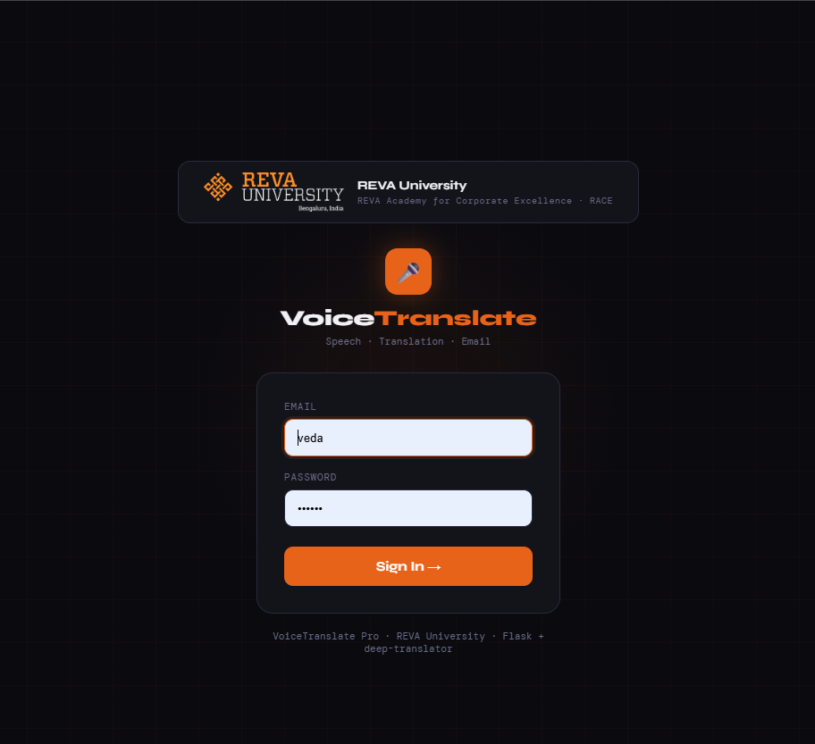
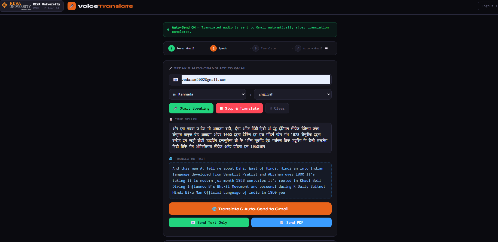
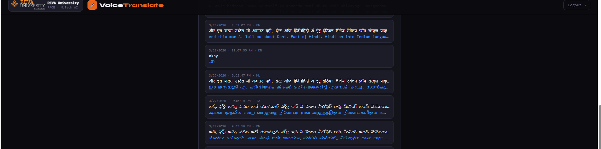

# Voice Translate Web App

A Flask-based voice translation and email delivery application that converts speech to text, translates text into a target language, and sends results via email.

## Features

- User login-protected dashboard
- Text translation via `deep-translator` using Google Translate
- Email delivery of:
  - translated text
  - PDF attachments
  - audio attachments
  - generated text-to-speech audio
- Text-to-speech support using `gTTS`

## Prerequisites

- Python 3.10 or later
- Gmail account with App Password enabled for SMTP access

## Installation

1. Clone the repository or download the project files.
2. Create and activate a Python virtual environment:

```bash
python -m venv venv
venv\Scripts\activate
```

3. Install dependencies:

```bash
pip install flask flask-mail deep-translator gtts
```

## Configuration

Update SMTP and login settings in `app.py` before starting the application.

- `MAIL_USERNAME` and `MAIL_PASSWORD` must be your Gmail credentials or App Password.
- `EMAIL` and `PASSWORD` are the demo login credentials for the application.

> Important: For production, do not store credentials directly in source code. Use environment variables or a configuration file instead.

## Running the App

From the project root, run:

```bash
python app.py
```

Then open your browser and navigate to:

```
http://127.0.0.1:5000/
```

## Usage

1. Log in on the home page.
2. Access the dashboard to record or enter text.
3. Submit text for translation.
4. Choose to send translation results via email, attach audio, or generate TTS audio.

## Screenshots

Below are example outputs from the application:

- Login page: `output/login.png`
- Translation and audio output: `output/voice-text-translate-aduio.png`
- History or result view: `output/history.png`







![history Output}(output/v

## Project Structure

- `app.py` - Main Flask application, email routes, TTS, and session management.
- `translate.py` - Translation blueprint using `deep-translator`.
- `templates/` - HTML templates for login and dashboard.

## Notes

- The current implementation uses a demo login and hard-coded credentials for demonstration.
- Update `app.secret_key` before deployment.
- Adjust email handling to secure credentials and support environment-based configuration.

## 🌐 Live Demo

👉 https://smart-voice-to-document-conversion-with-7pi1.onrender.com/


